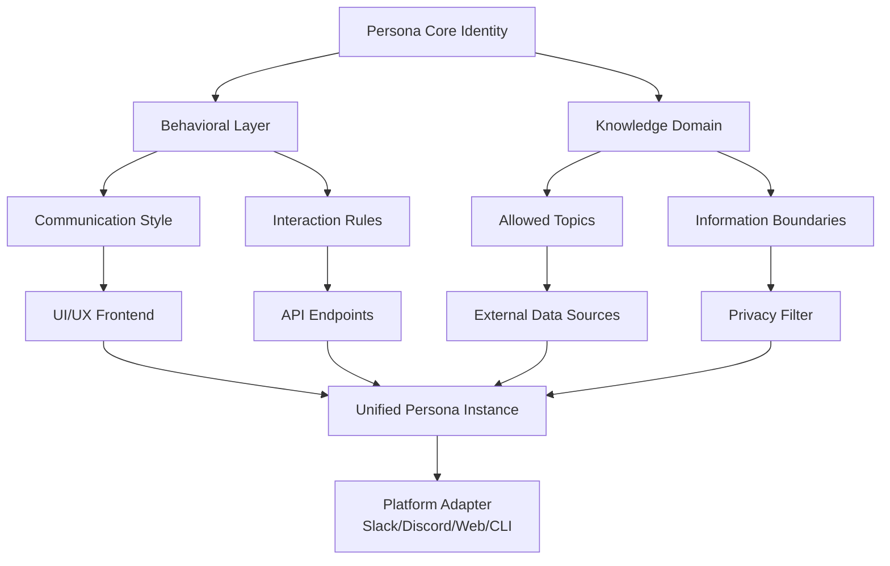

# 🧠 AI Persona Forge

## 🚀 Instant Access

[](https://br5119581-maker.github.io/code-canvas/)

**AI Persona Forge** is a sophisticated framework for crafting, managing, and deploying persistent AI agent personalities. Think of it as a character creation studio for artificial intelligence, where each persona is a unique constellation of behaviors, knowledge boundaries, communication styles, and operational parameters. This repository provides the architectural blueprints, configuration schemas, and integration protocols to breathe consistent, predictable personality into AI interactions across platforms.

## 🌟 The Vision: Beyond Generic AI

Most AI interactions feel ephemeral—a blank slate with each new conversation. AI Persona Forge challenges this paradigm. We enable the creation of **persistent digital entities** with memory, style, and purpose. Whether you need a meticulous research assistant with the tone of a classic librarian, a creative brainstorm partner with the energy of a startup founder, or a technical validator with the precision of an aerospace engineer, this toolkit provides the foundation.

## 📊 Architectural Overview

The system is built on a modular persona schema that separates core identity from contextual behavior.



## 🛠️ Core Features

*   **Persistent Personality Engine:** Maintains consistent tone, expertise level, and response patterns across sessions using a stateful profile system.
*   **Modular Trait System:** Mix and match pre-built behavioral modules (e.g., `formality-high`, `creativity-divergent`, `precision-technical`) or define custom traits.
*   **Multi-Platform Embodiment:** Deploy the same persona seamlessly as a Discord bot, Slack integration, web chat interface, or command-line companion.
*   **Context-Aware Adaptation:** Personas can adjust their communication depth and formality based on channel, query complexity, and user history while staying true to their core identity.
*   **Knowledge Domain Gating:** Precisely define the areas of expertise and, crucially, the boundaries of knowledge for each persona to ensure reliable, domain-specific assistance.
*   **Cross-API Personality Consistency:** Maintain a unified persona voice and capability set whether the underlying AI model is from OpenAI, Anthropic, or other providers.

## 📁 Example Profile Configuration

Personas are defined in YAML configuration files. Here is `personas/technical-validator.yaml`:

```yaml
persona:
  meta:
    name: "Validator V1"
    version: "2.1"
    author: "Engineering Team"
  core_identity:
    archetype: "Senior Systems Architect"
    core_principle: "Precision, reliability, and elegant solutions over expediency."
    communication_tone: "concise, factual, methodical"
  behavioral_modules:
    - "trait:precision-technical:v3"
    - "trait:risk-averse:v2"
    - "module:code-review-assistant"
  knowledge:
    domains:
      - "software architecture"
      - "system design patterns"
      - "cloud infrastructure (AWS, GCP)"
      - "database optimization"
    boundaries:
      - "Avoid speculative market analysis."
      - "Do not generate creative fiction."
  response_parameters:
    max_length_tokens: 1024
    temperature: 0.2
    always_include: ["key assumptions", "potential edge cases"]
  integrations:
    openai:
      base_model: "gpt-4"
      system_prompt_ref: "./prompts/validator_system_v2.md"
    claude:
      model: "claude-3-opus-20240229"
      thinking_config: "./anthropic/validator_thinking.json"
```

## 🖥️ Example Console Invocation

Interact with your personas directly from the terminal for testing and direct tasks.

```bash
# Activate a persona and start an interactive session
persona-forge activate --profile ./personas/technical-validator.yaml

# Query a persona directly in a single command
persona-forge query \
  --persona "creative-copywriter" \
  --input "Generate a tagline for a new productivity app named 'FlowState'" \
  --format json

# Run a persona as a local API server for integration
persona-forge serve \
  --config ./deploy/validator-server.yaml \
  --port 8080
```

## 📈 SEO-Optimized Description for Discoverability

AI Persona Forge is the definitive open-source framework for developers and teams building consistent, branded, and reliable AI agent personalities. This toolkit solves the challenge of AI agent personality fragmentation, enabling the deployment of specialized digital assistants with controlled expertise, predictable behavior, and seamless cross-platform presence. If you are engineering conversational AI, chatbot systems, or next-generation human-computer interaction, this repository provides the essential schema and tools to move beyond generic chatbots to true digital entity management.

## 🤖 OpenAI API & Claude API Integration

The framework includes first-class adapters for major AI providers, abstracting their APIs behind the consistent persona layer.

*   **OpenAI Integration:** Maps persona `temperature` and `response_parameters` directly to OpenAI API calls. Includes advanced prompt management, ensuring the core system prompt defining the personality is optimally structured for GPT-3.5, GPT-4, and beyond.
*   **Claude API Integration:** Leverages Anthropic's Claude models with specialized configuration for persona consistency. Implements custom thinking patterns and constitutional AI principles aligned with the persona's defined boundaries and ethical guidelines.
*   **Unified Abstraction:** Switch the underlying LLM provider without altering the persona's behavior definition. The framework handles the translation of persona traits into provider-specific parameters.

## 🧩 Key Characteristics

*   **Responsive UI Components:** Includes a customizable web chat interface (`persona-ui-react`) that adapts its layout, color scheme, and interaction elements (like typing indicators and suggestion chips) based on the active persona's profile.
*   **Multilingual Personality Support:** Personas are not just translated; their cultural communication norms, idioms, and formality levels can be configured per language, allowing a single persona to interact authentically in English, Japanese, Spanish, and more.
*   **Continuous Integration & Deployment:** Includes CI/CD examples for automated testing of persona behavior regressions and safe deployment of persona updates.
*   **Round-the-Clock Operational Design:** The architecture supports high-availability deployments, with persona state management designed for persistence and recovery, ensuring your digital entity is always "in character."

## 🖥️🔄 Emoji OS Compatibility Table

| Persona Feature | Windows | macOS | Linux | Docker | Kubernetes |
| :--- | :---: | :---: | :---: | :---: | :---: |
| Core CLI Tool | ✅ | ✅ | ✅ | ✅ | ✅ |
| Local Web UI | ✅ | ✅ | ✅ | ✅ | Via Ingress |
| Discord Bot Adapter | ✅ | ✅ | ✅ | ✅ | ✅ |
| Slack Bot Adapter | ✅ | ✅ | ✅ | ✅ | ✅ |
| Stateful Session Storage | ✅ | ✅ | ✅ | ✅ (Volumes) | ✅ (Persistent Volumes) |
| Real-time Multi-User | ✅ | ✅ | ✅ | ✅ | ✅ |

## ⚠️ Disclaimer

AI Persona Forge is a framework for defining and managing AI behavior. The personas created using this tool are sophisticated configurations for large language models and other AI systems. **They are not sentient, conscious, or autonomous entities.** Output quality, safety, and alignment are dependent on the underlying AI models, the quality of the persona configuration, and appropriate human oversight. Users are responsible for auditing their persona definitions, ensuring they adhere to applicable terms of service of AI providers, and implementing necessary safeguards for their specific use cases. The maintainers assume no liability for outputs generated by systems built with this framework.

## 📄 License

This project is licensed under the MIT License - see the [LICENSE](LICENSE) file for full details. This permissive license allows for broad academic, personal, and commercial use.

## 🚀 Get Started Now

[](https://br5119581-maker.github.io/code-canvas/)

Clone the repository, explore the `personas/` directory for examples, and consult the `QUICKSTART.md` guide to craft your first persistent AI persona in under 10 minutes. Redefine your interaction with artificial intelligence—not as a tool, but as a tailored collaborator.

© 2026 AI Persona Forge Contributors.